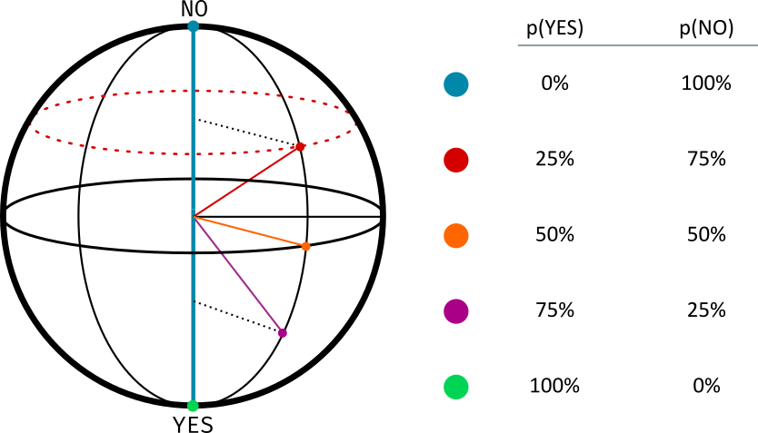
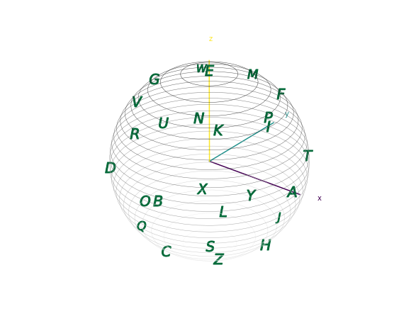
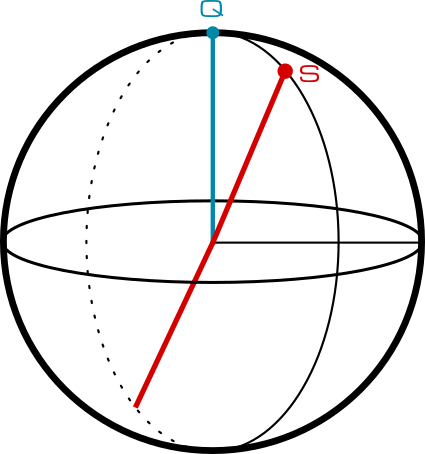
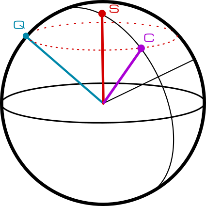

If the ⬜🟨🟩 emoji look famliar to you, you may have, like most of us, been playing a lot of [Wordle][wordle].

But what if Wordle was played on a quantum computer --- and with just 5 qubits?

## Rules of Wordle

In case you're not familiar with Wordle, here's how it's played: there's a five letter word you need to guess. You're given 6 tries to guess it. After each try, you're told:
- Which letters of your word are **not** in the word to guess,
- Which letters of your word **are** in the word to guess, but in the wrong position,
- Which letters of your word are in the word to guess, and in the **correct** position.

Since there's some 6000-ish (or more) 5-word letters, this means you'll need at least 12 bits to represent each guess.

## Bringing Wordle to the Quantum Wordl

### The Bloch Sphere

But now, imagine you're given 5 quantum bits: one for each letter to guess. We'll keep it simple and leave them unentangled to play nice with NISQ.

In these conditions, each qubit, by virtue of being quantum, is actually described by a full 2D-space, with some particular periodic conditions; in fact, the state of each qubit is well represented by a sphere, the so-called Bloch sphere:


The catch is that you don't observe this sphere, or the φ, or θ angles. Instead, you're only allowed to pick some direction of projection (a diameter of the sphere, in the above reprensentation), and will observe either a **yes** or **no** outcome, based on how the state is projected on the direction of measurement. This is easier to see in practice; consider that you're measuring along the blue direction, and you have a blue, a red, an orange, a purple, and a green state. Each has a different projection along our chosen direction, and corresponding probabilities:



Furthermore, every state that lives in the red equator will have the same projection along the blue axis --- and therefore the same probability of observing `yes` or `no` --- **even though they're different states**.

There's another catch: if you estimate `p(NO)` as the relative frequency of `NO` in a number of shots, then, for a limited number of shots, there's some error margin in your estimation.

### Rules of Quordle

In Quordle, every letter lives in the Bloch sphere. The word you need to guess, then, is given by five states on five Bloch spheres.

In each round, your guess (which **must be a valid word**) will define five bases to project the different qubits onto. As a reply, you'll get the frequencies with which you observed a `no` on each qubit.



Imagine that you're trying to guess `QUBIT`, and have guessed `CLASS`. For the first qubit, you should get a fairly high probability of observing `NO`:



However, there are other letters near `Q` that are compatible with that probability: 



By trying different words and looking at the Bloch sphere and the measurements you get, try to find the hidden word in the least number of guesses! ([Psst: you'll be doing state tomography!][tomography])

**Remember the catch:** If there's a low number of shots, or a lot of noise, the probabilities reported may be inaccurate!

### Playing Quordle

You can play Quordle in the `Quordle.ipynb` notebook (follow the instructions there to set up the game). After each guess, you'll see a Bloch sphere, and a keyboard showing the `no` measurement frequencies for each letter. By clicking a letter, you can examine the letters in the Bloch sphere that are compatible with the observed frequency. (To help you out, letters that are likely are opaque and green, and letters that are unlikely are red.)

## Installation

Quordle runs in [Jupyter Notebooks][jupyter]. It's important that you use the notebook, not Jupyter Lab, because we use some of the browser's capabilities to make Quordle more interactive.

To develop Quordle, we used a virtual environment, and recommend you do the same. Due to Jupyter's own internals, however, it's likely you'll have to install `jupyter-notebook` globally, and then configure it to run with your virtual environment. Otherwise, all the requirements are listed in `requirements.txt`. Thus, to launch Quordle, do:

```bash
# Install jupyter notebook globally
pip install jupyter-notebook

# Source your virtual environment
source virtualenv/bin/activate

# Install ipykernel to set up your virtualenv with jupyter
pip install ipykernel
python -m ipykernel install --user --name=virtualenv

# Install the remaining requirements
pip install -r requirements.txt

# Start the Jupyter Notebook interface
jupyter notebook

# Open Quordle.ipynb
```

## Our Experience At iQuHACK

Bringing together the world of quantum simulation and of game making was a weird but ultimately satisfying experience: in true *hack*athon fashion, we ended up bending Jupyter Notebooks to our will, with much thanks to the prior work of [ipycanvas][ipycanvas]. It was an opportunity for us, though we're acquainted with the workings of a single qubit, to consider what aspects would be more intuitive to a layman, and how to connect the aspects that weren't with visual representation and gamification.

iQuHACK also presented us with a great opportunity to learn about Azure Quantum and the IonQ platforms, which we had never worked with before. As a result, we are now more acquainted with these great quantum frameworks, which will be very useful for us in the future!

[wordle]: https://www.powerlanguage.co.uk/wordle/
[tomography]: https://en.wikipedia.org/wiki/Quantum_tomography
[jupyter]: https://jupyter.org/
[ipycanvas]: https://ipycanvas.readthedocs.i
